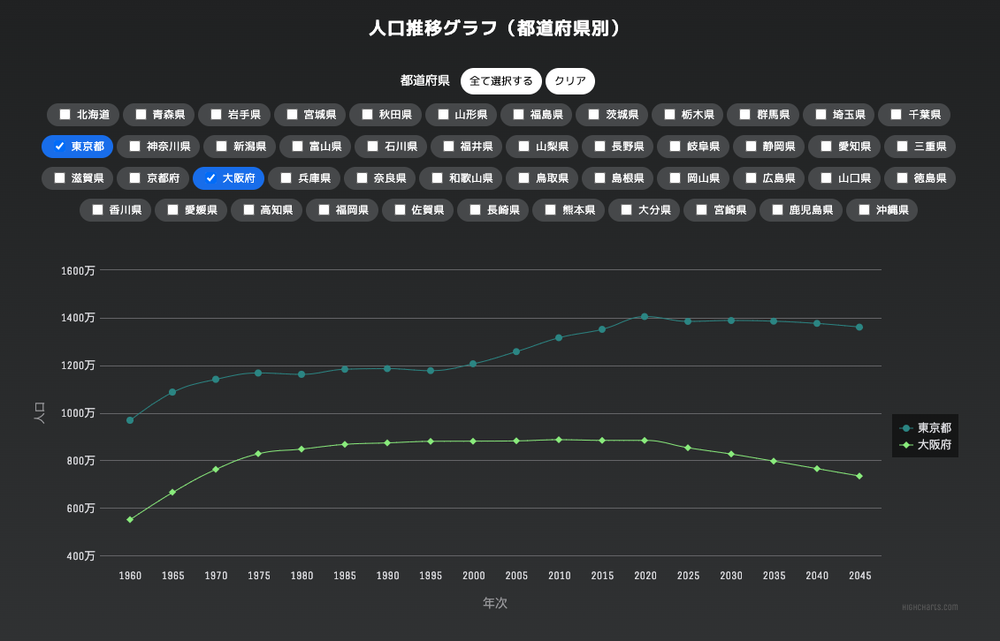

[English README](https://github.com/mayl730/population-of-japan/blob/main/README-jp.md)

# 日本の都道府県別人口グラフ

Vue3 + Vite を使用しているプロジェクトです。日本の人口動向を発見しよう！

このプロジェクトでは、好きな都道府県を選び、日本の人口データを探索することができます。国の人口統計の変化についてもっと学びましょう！



デモサイト:
[https://population-of-japan.vercel.app/](https://population-of-japan.vercel.app/)

## 技術スタック

- [x] [VueJS (Vue3)](https://vuejs.org/)
- [x] [Vite](https://github.com/vitejs/vite)
- [x] [Pinia](https://pinia.vuejs.org/) 状態管理
- [x] [RESAS API](https://opendata.resas-portal.go.jp/) 日本の人口データを取得する API
- [x] [Highcharts](https://www.highcharts.com/) インタラクティブなグラフ
- [x] [TypeScript](https://www.typescriptlang.org/) および [Vue tsc](https://github.com/johnsoncodehk/volar/tree/master/vue-language-tools/vue-tsc) 静的解析
- [x] [ESLint](https://eslint.vuejs.org/) 構文チェックとコードスタイルを統一する

## 概要

以下の手順に従って、プロジェクトをローカル環境でセットアップして実行してください。

### 事前に必要なもの

ビルド前に最低限，以下のソフトウェアが必要です。

- git
- Node.js (https://nodejs.org)

### 推奨の IDE

- [VS Code](https://code.visualstudio.com/) + [Volar](https://marketplace.visualstudio.com/items?itemName=Vue.volar) (Vetur を無効にします) + [TypeScript Vue Plugin (Volar)](https://marketplace.visualstudio.com/items?itemName=Vue.vscode-typescript-vue-plugin).

### インストール

1. リポジトリをローカルマシンにクローンしてください。

```bash
git clone https://github.com/mayl730/population-of-japan
```

2. npm を使用して dependencies をインストールしてください。

```bash
npm install
```

3. RESAS でサインアップして、API キーを取得してください： [RESAS API](https://opendata.resas-portal.go.jp/)

4. 環境ファイルを設定し、`.env`という名前で保存してください。 [環境ファイルのテンプレートをご利用ください](https://github.com/mayl730/population-of-japan/blob/main/.env.template)

環境設定ファイルにご自身の API キーを追加してください。

```env
VITE_API_KEY=XXXXXXXXXXXXXXXXXXXXXX
```

5. 発用サーバーの起動:

以下のコマンドを使用して、開発用サーバーを起動してください。

```bash
npm run dev
```

### 追加のコマンド

`npm run build` : `dist`フォルダに本番用のコードをビルドします。

## 将来のアップデート

- [ ] ウェブサイト上でのエラーメッセージの表示（失敗した場合）。
- [ ] Cypress を使用したテストの実施。
